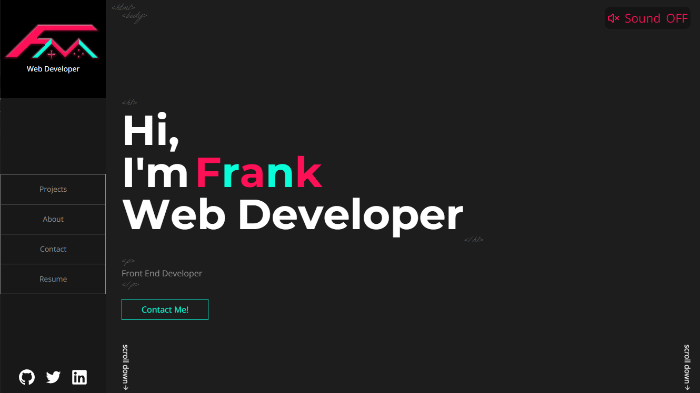

[](https://franklinmv.netlify.app/)
# PersonalWeb

This *PersonalWeb* project was made with the purpose of putting into practice basic concepts in web development with Angular Framework.


This project was generated with [Angular CLI](https://github.com/angular/angular-cli) version 12.1.1.

## Development server

```sh
  ng serve
```
Run `ng serve` for a dev server. Navigate to `http://localhost:4200/`. The app will automatically reload if you change any of the source files.

## Building and Running for Production

1. Install the Angular CLI

   ```sh
   npm install -g @angular/cli
   ```
2. Install dependencies

    ```sh   
   npm install
    ```

3. Run ng build

    ```sh   
   ng build
    ```

The build artifacts will be stored in the `dist/` directory.

## Design

The initial design is available on the figma platform  [Figma](https://www.figma.com/file/K88fooVFq3cyWI2BAMq5Ib/personalWebV2?node-id=0%3A1).

## Attribution.

The main objective of this project was to practice front-end web development and at the same time show the projects that I have worked on, but I was not sure which way to go, so I looked for examples of websites of talented people with a lot of more experience than me.

So I found the portfolios of [jacek jeznach](https://jacekjeznach.com/) and [Brittany Chiang](https://brittanychiang.com/) that strongly influenced this project.
